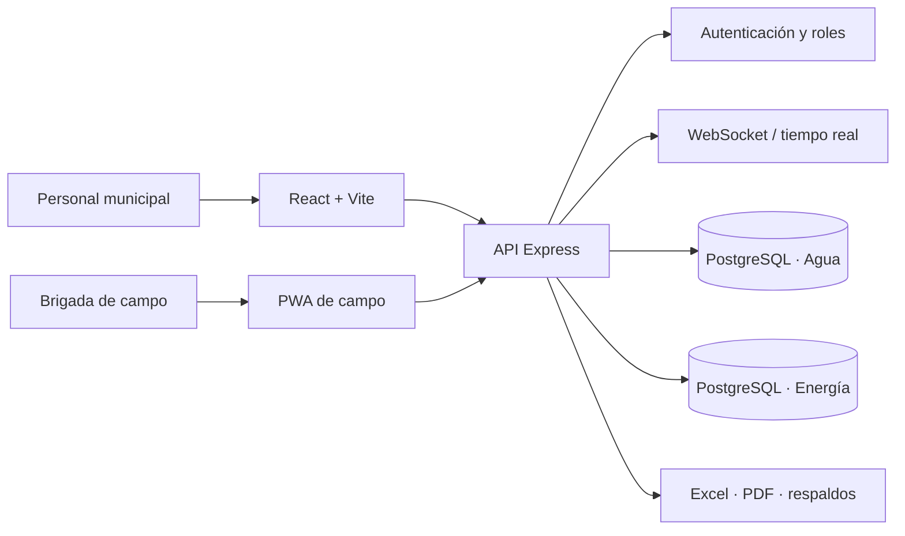

<div align="center">

# Plataforma Municipal de Servicios Públicos

**Agua, energía, caja y trabajo de campo conectados en una sola solución.**

[](https://github.com/OleOle19/sistema-agua-municipalidad/actions/workflows/ci.yml)


[Resumen](#el-proyecto) · [Módulos](#módulos) · [Arquitectura](#arquitectura) · [Ejecución local](#ejecución-local)

</div>

## El proyecto

Plataforma full stack creada para digitalizar la operación diaria de servicios públicos municipales. Centraliza el padrón de contribuyentes, la facturación de agua y energía, la cobranza, el cierre de caja, la auditoría y el trabajo de brigadas desde dispositivos móviles.

El reto no era construir un CRUD aislado, sino integrar procesos administrativos y operativos que comparten usuarios, deuda, pagos y trazabilidad sin perder la separación entre dominios ni la seguridad de la información.

> **Caso de estudio de portafolio.** El repositorio contiene código y configuración de ejemplo. Las credenciales, bases de datos, respaldos, documentos y datos reales no se versionan.

### Lo más relevante

- Flujo completo desde el registro del contribuyente hasta el pago, recibo y cierre de caja.
- Caja unificada para cobrar servicios de agua y energía desde una misma interfaz.
- Aplicación PWA para visitas de campo, evidencias y sincronización con conectividad limitada.
- Roles jerárquicos, autenticación JWT, bloqueo de acceso y bóveda de credenciales cifradas.
- Auditoría estructurada, operaciones reversibles y alertas sobre movimientos de riesgo.
- Reportes operativos, exportación a Excel y generación de comprobantes listos para imprimir.
- Migraciones incrementales, verificación de respaldos, pruebas automatizadas y CI en GitHub Actions.

## Módulos

| Módulo | Responsabilidad | Capacidades destacadas |
| --- | --- | --- |
| **Agua** | Gestión comercial del servicio | Padrón, deuda, recibos, pagos, cortes, estados de conexión y reportes |
| **Energía** | Operación eléctrica independiente | Suministros, lecturas, facturación, pagos, usuarios y auditoría |
| **Caja municipal** | Cobranza centralizada | Búsqueda transversal, órdenes de cobro, medios de pago, arqueo y cierre |
| **App de campo** | Trabajo móvil de brigadas | PWA instalable, consultas, solicitudes, evidencias y operación offline |

## Arquitectura



La interfaz principal usa carga diferida por dominio para mantener separados los módulos de Agua, Energía y Caja. El backend concentra las políticas transversales —autenticación, autorización, auditoría, seguridad HTTP y automatizaciones— mientras conserva bases de datos independientes para cada servicio.

### Decisiones técnicas

- **Separación por dominios:** cada módulo mantiene su interfaz y persistencia, con Caja como capa de integración.
- **Defensa en profundidad:** JWT, políticas por rol, rate limiting, CSP/HSTS, CORS restringido y secretos fuera del repositorio.
- **Trazabilidad operativa:** las acciones sensibles producen eventos de auditoría y requieren permisos explícitos.
- **Evolución segura:** migraciones SQL ordenadas, scripts de saneamiento en modo reporte/aplicación y validación de respaldos.
- **Experiencia resiliente:** PWA para campo, estados de conexión y sincronización en tiempo real opcional.

## Stack

| Capa | Tecnologías |
| --- | --- |
| Frontend | React 19, Vite, Bootstrap 5, React Icons |
| Backend | Node.js 22, Express 5, WebSocket, JWT, bcrypt |
| Datos | PostgreSQL, migraciones SQL, ExcelJS |
| Calidad | Node Test Runner, ESLint, GitHub Actions, npm audit |
| Operación | PowerShell, respaldos automatizados, HTTPS y compresión Brotli/gzip |

## Ejecución local

### Requisitos

- Node.js 22+
- PostgreSQL 16+
- Dos bases de datos locales: una para Agua y otra para Energía

### Instalación

```bash
git clone https://github.com/OleOle19/sistema-agua-municipalidad.git
cd sistema-agua-municipalidad
npm run setup
```

Configura las variables de entorno sin versionar secretos:

```bash
cp server/.env.example server/.env
cp client/.env.example client/.env
```

En Windows PowerShell, el equivalente es `Copy-Item server/.env.example server/.env` y `Copy-Item client/.env.example client/.env`.

Aplica las migraciones y levanta ambos procesos en terminales separadas:

```bash
npm run migrate
npm run dev:api
npm run dev:web
```

La interfaz queda disponible en `http://localhost:5173` y la API en `http://localhost:5000`.

## Calidad

La validación local reproduce las comprobaciones principales del flujo de integración continua:

```bash
npm run validate
```

Este comando ejecuta las pruebas del backend, el análisis estático del frontend y el build de producción. GitHub Actions añade además una auditoría de vulnerabilidades de dependencias en cada cambio enviado a `main` y en cada pull request.

## Estructura

```text
├── client/        # Aplicación React: Agua, Energía y Caja
├── server/        # API, seguridad, lógica de negocio y migraciones
├── campo-app/     # PWA ligera para brigadas municipales
├── ops/           # Scripts de despliegue y operación
├── docs/          # Decisiones técnicas y guías de migración
└── .github/       # Integración continua
```

## Autor

Proyecto diseñado y desarrollado por [@OleOle19](https://github.com/OleOle19) como solución aplicada a una operación municipal real.
